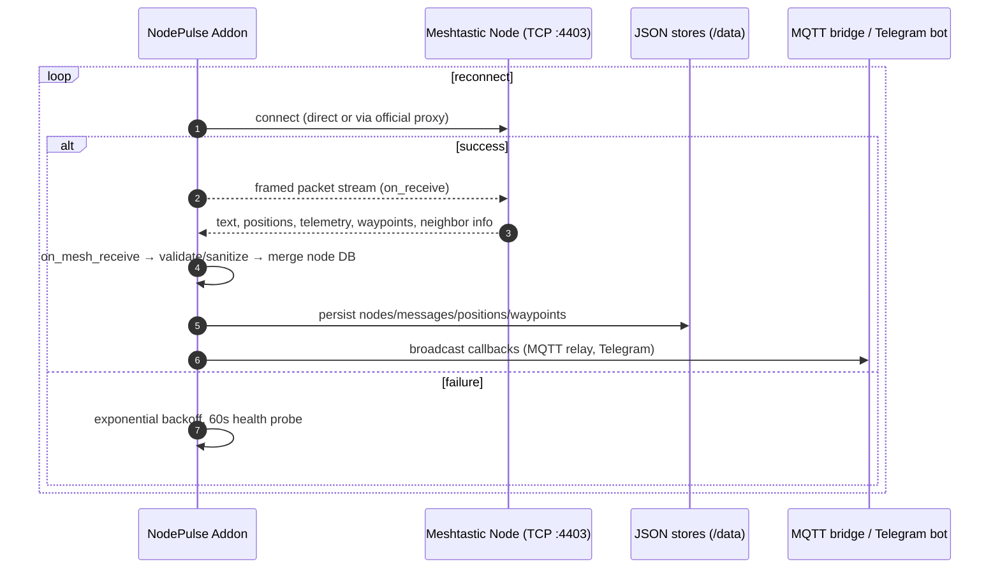
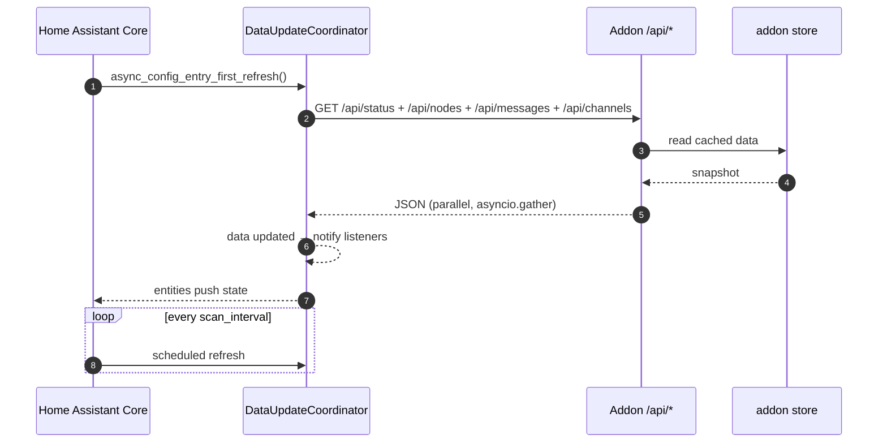
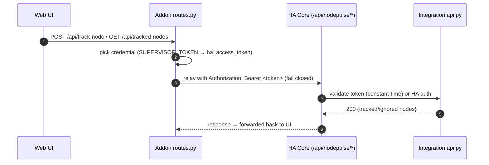

# NodePulse — Developer Guide

This guide is for contributors. For user-facing documentation see
[README.md](./README.md), [FEATURES.md](./FEATURES.md),
[STANDALONE_DOCKER.md](./STANDALONE_DOCKER.md), and
[SECURITY.md](./SECURITY.md).

---

## Repo layout

```
NodePulse/
├── custom_components/nodepulse/   # Home Assistant integration
│   ├── __init__.py                # entry-point wiring (async_setup(_entry))
│   ├── coordinator.py             # DataUpdateCoordinator + addon REST client
│   ├── const.py                   # constants + pure node-id helpers
│   ├── config_flow.py             # setup / options wizard
│   ├── host_candidates.py         # supervisor-DNS host discovery
│   ├── validation.py              # HA-free input helpers (unit-testable)
│   ├── helpers.py                 # coordinator_for + NodeDiscovery (shared)
│   ├── sensor.py                  # Node Count + 24 per-node sensors
│   ├── binary_sensor.py           # Connection + per-node Online
│   ├── device_tracker.py          # GPS trackers (nodes with a GPS fix)
│   ├── geo_location.py            # Geo location entities (native map)
│   ├── notify.py                  # NotifyEntity gateway + per-channel
│   ├── device_trigger.py          # message-received/sent device triggers
│   ├── device_action.py           # send / request-position / trace actions
│   ├── api.py                     # /api/nodepulse/* relay views
│   └── services.yaml              # send_message / request_position / trace_route
├── nodepulse-addon/               # the addon (aiohttp app + Web UI)
│   ├── config.json                # addon manifest (options + schema, ingress)
│   ├── Dockerfile / Dockerfile.standalone
│   ├── app/
│   │   ├── main.py                # aiohttp app, lifecycle, route table
│   │   ├── config.py              # /data/options.json (or dev_options.json)
│   │   ├── connection.py          # Meshtastic TCP client + packet callbacks
│   │   ├── routes.py              # REST API + HA relay + auth waterfall
│   │   ├── mqtt_bridge.py         # bidirectional MQTT bridge + filters
│   │   ├── telegram_bot.py        # Telegram bridge + /commands
│   │   ├── device_config.py       # remote radio configuration
│   │   └── security_scanner.py    # encryption-key weakness detection
│   ├── web_ui/                    # HTML + JS dashboard (served at /)
│   ├── tests/unit/                # pytest unit tests (204 passed)
│   ├── tests/e2e/                 # Playwright E2E (needs a browser binary)
│   └── DOCS.md                    # addon-store description + architecture
├── tests/test_nodepulse_integration_pure.py  # HA-free integration tests
├── SECURITY.md / FEATURES.md / README.md / CHANGELOG.md / CODE_REVIEW.md
```

---

## Setting up a dev environment

```bash
# Addon (local run, no HA)
cd nodepulse-addon
python3 -m venv .venv && source .venv/bin/activate
pip install -r requirements.txt -r requirements-test.txt
cp dev_options.json ~/nodepulse-dev-config.json   # edit meshtastic_host
python -m app.main
# http://localhost:8099/ui/index.html
```

The integration itself is only runnable inside Home Assistant; edit it and
copy `custom_components/nodepulse/` into `config/custom_components/`, then
do a **full HA restart** (Reload does not re-import platforms).

---

## Lint, type, and tests

```bash
ruff check custom_components/nodepulse/ tests/          # integration
ruff check nodepulse-addon/app/                         # addon
python3 -m py_compile custom_components/nodepulse/*.py

# Addon unit suite (fast, no hardware/HA):
cd nodepulse-addon && python3 -m pytest tests/unit/ -q

# HA-free integration tests (no homeassistant installed):
python3 -m pytest tests/test_nodepulse_integration_pure.py -q

# E2E (needs playwright + chromium; not part of the default unit run):
cd nodepulse-addon && playwright install chromium && python3 -m pytest tests/e2e/ -q
```

> **HA integration tests:** `tests/test_nodepulse_integration_ha.py` covers
> `async_setup_entry`/`async_unload_entry`, the options flow, untrack→re-track,
> and `_validate_token`. They need a HA test environment to execute:
> `pip install homeassistant pytest-homeassistant-custom-component && python -m pytest tests/test_nodepulse_integration_ha.py`.
> Without it they skip cleanly; the pure-logic suite (`tests/test_nodepulse_integration_pure.py`) always runs.
> (`pytest-homeassistant-custom-component` is not vendored). New pure logic
> must live in `const.py` / `validation.py` / `helpers.py` so it is testable
> without HA; tests go in `tests/test_nodepulse_integration_pure.py`.

---

## Architecture

### 1. System overview

See the block/sequence diagrams in `nodepulse-addon/DOCS.md`. In short:
a Meshtastic node exposes a single TCP interface (port 4403); the addon
owns that connection, decodes packets into a persistent JSON store, and
serves them over `GET /api/*` to both the bundled Web UI and the HA
integration's `DataUpdateCoordinator`.

### 2. Addon connection lifecycle



### 3. HA integration poll cycle



### 4. Entity discovery (`helpers.py`)

`NodeDiscovery` is the single mechanism the four platform modules
(sensor, binary_sensor, device_tracker, geo_location) use to keep per-node
entities in sync with `coordinator.tracked_nodes`:

- `run()` is idempotent and safe to call on every coordinator refresh.
- Entities are keyed by **node id**, so untrack → re-track always
  re-creates them (fixes S6).
- It honors the tracked-nodes gate, removes entities for nodes that are
  untracked or gone, and calls `should_create(node)` /
  `make_entities(node)` for platform-specific decisions (e.g. a GPS fix).
- `attach()` runs once for loaded data, then subscribes via
  `entry.async_on_unload(coordinator.async_add_listener(...))`.

### 5. Track-in-HA relay and auth waterfall



The relay **fails closed**: no credential ⇒ request rejected. The legacy
`X-NodePulse-Skip-Token` bypass is removed.

---

## Conventions & contribution checklist

- **Language:** all code, comments, docstrings, commit messages, and docs in
  English.
- **Lint:** run `ruff check` on both the integration and addon before
  committing.
- **Pure logic:** keep HA-free helpers in `const.py`, `validation.py`, or
  `helpers.py` and add unit tests to `tests/test_nodepulse_integration_pure.py`.
- **Discovery:** do **not** copy the register/remove loop into a new platform —
  reuse `helpers.NodeDiscovery`.
- **Secrets:** `dev_options.json` placeholders must stay empty — **never
  commit real access keys, HA access tokens, or bot tokens** (see
  [SECURITY.md](./SECURITY.md#6-configuration-hygiene-developers)).
- **Docs:** update `README.md`, `FEATURES.md`, and `CHANGELOG.md` when a
  user-visible behavior changes; update `CODE_REVIEW.md` statuses when
  closing a review item.

### Walkthrough: adding a new per-node sensor

1. Add a class in `sensor.py` subclassing `_NodeSensorBase`; set
   `_metric_key`, `_attr_name`, optional device class / unit / icon, and a
   unique id suffix (`f"{entry.entry_id}_{node_id}_<metric>"`).
2. Add it to the `sensor_set` list inside `_make_sensors` in
   `async_setup_entry`. Only sensors with a non-`None` `native_value` are
   created, so nodes without the metric stay uncluttered.
3. If the field comes from the addon payload, coerce defensively with
   `as_int` / `as_float` (Q16).
4. Add a row to the sensor table in `FEATURES.md`, note it in
   `CHANGELOG.md`, and cover any new pure logic in the integration tests.