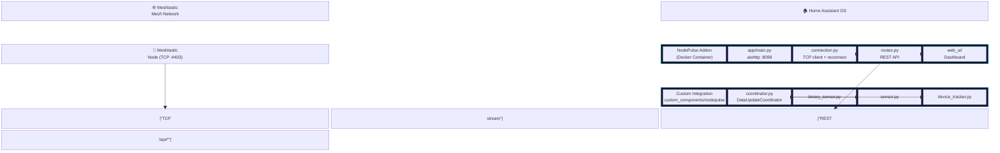
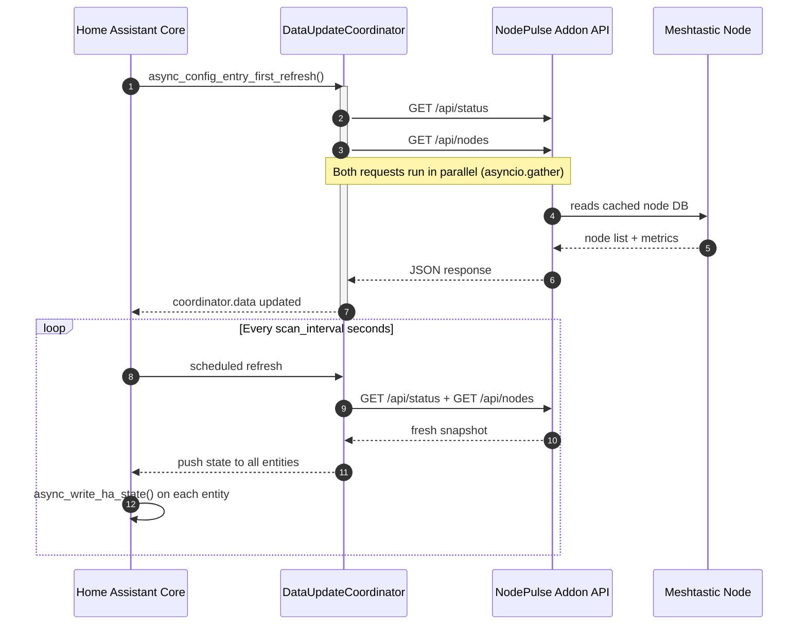
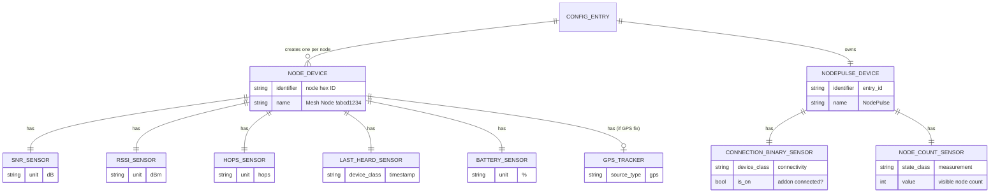

# NodePulse

**Real-time Meshtastic mesh network monitoring for Home Assistant.**

NodePulse is a Home Assistant addon and custom integration that gives you deep visibility into your Meshtastic mesh network — node health, signal metrics, GPS positions on the HA map, and encrypted direct messaging — all from inside Home Assistant.

> ⚠️ **Clean Room Implementation**: NodePulse is built entirely from scratch. It does not use any code from MeshSense or any other prior project. MeshSense was used only as a conceptual feature reference.

---

## Features

| Feature | Description |
|---|---|
| 🟢 **Connection Status** | Binary sensor — know immediately if your mesh link drops |
| 📡 **Node Count** | Live count of all visible mesh nodes |
| 📶 **Per-Node Metrics** | SNR, RSSI, hops away, battery level, last heard — one HA device per node |
| 🗺️ **GPS Mapping** | Device trackers plotted on the native HA map card |
| 💬 **Messaging** | Send broadcast or DM messages via the Web UI |
| 🔍 **Traceroute** | Dispatch traceroutes to any node from the Web UI |
| 🖥️ **Web UI Dashboard** | Full-featured dashboard served via HA Ingress (no port forwarding) |

---

## Architecture

### System Overview



### Poll Cycle — Data Flow



### HA Entity Model



---

## Installation

### 1. Install the Addon

1. In Home Assistant, go to **Settings → Add-ons → Add-on Store**.
2. Add this repository URL as a custom repository.
3. Install **NodePulse**.
4. Configure the addon options (see below) and start it.

### 2. Install the Custom Integration

1. Copy the `custom_components/nodepulse/` folder into your HA config's `custom_components/` directory.
2. Restart Home Assistant.
3. Go to **Settings → Integrations → Add Integration** and search for **NodePulse**.
4. Enter the addon URL (default: `http://localhost:8099`) and follow the setup wizard.

---

## Addon Configuration

| Option | Type | Default | Description |
|---|---|---|---|
| `meshtastic_host` | string | — | IP address or hostname of your Meshtastic node |
| `meshtastic_port` | int | `4403` | TCP port of the Meshtastic HTTP API |
| `access_key` | string | _(empty)_ | Optional access key if your node requires authentication |
| `scan_interval` | int | `30` | How often (seconds) the integration polls the addon (10–300) |
| `ignored_nodes` | list | `[]` | List of node hex IDs to exclude from all API responses |

---

## Technology Stack

| Component | Technology | Rationale |
|---|---|---|
| Addon backend | Python 3.12 + `aiohttp` | Pure Python, async, no native compilation — fully HAOS compatible |
| Meshtastic client | `meshtastic` PyPI library | Official library, pure Python |
| Web UI charts | Chart.js (CDN) | No build toolchain inside Docker |
| Web UI mapping | Leaflet.js (CDN) | Dark-theme tile layer, no API key |
| HA Integration | Python 3.12 + HA Core APIs | Standard custom component stack |

---

## Development

### Running the addon locally (without HA)

```bash
cd nodepulse-addon/
# Edit dev_options.json with your node's IP address
pip install -r requirements.txt
python -m app.main
# Open http://localhost:8099/ui/index.html
```

---

## Contributing

- All code comments, docstrings, commit messages, and documentation **must be in English**.
- Follow the SOLID and DRY principles described in the project rules.
- Run existing code through a linter before submitting a PR.

---

## License

MIT © NodePulse Contributors
