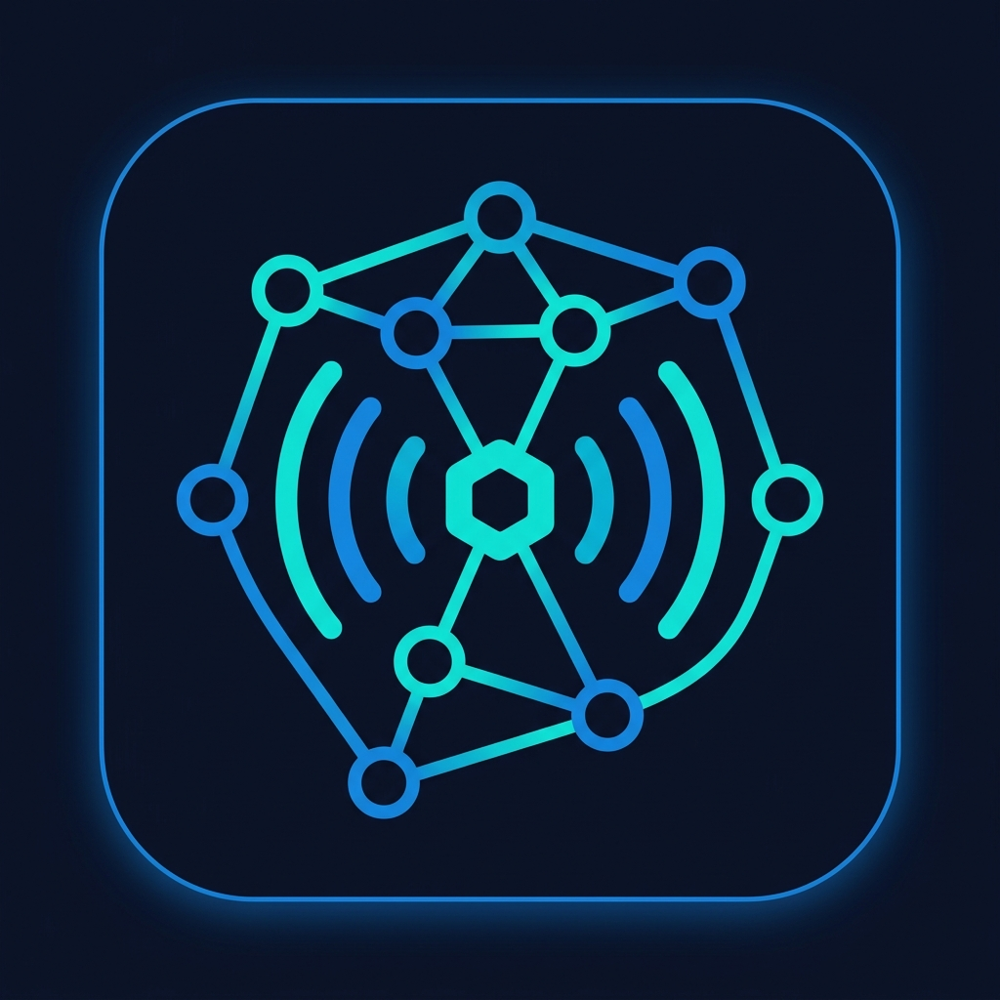
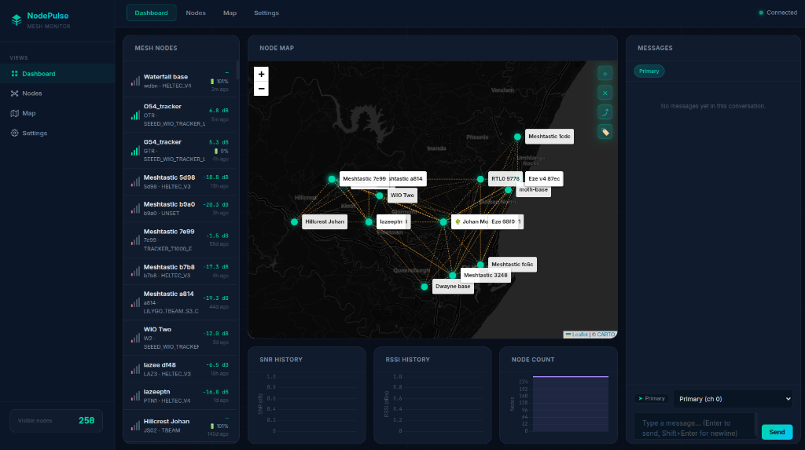
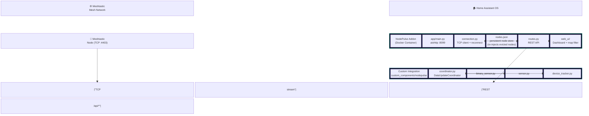
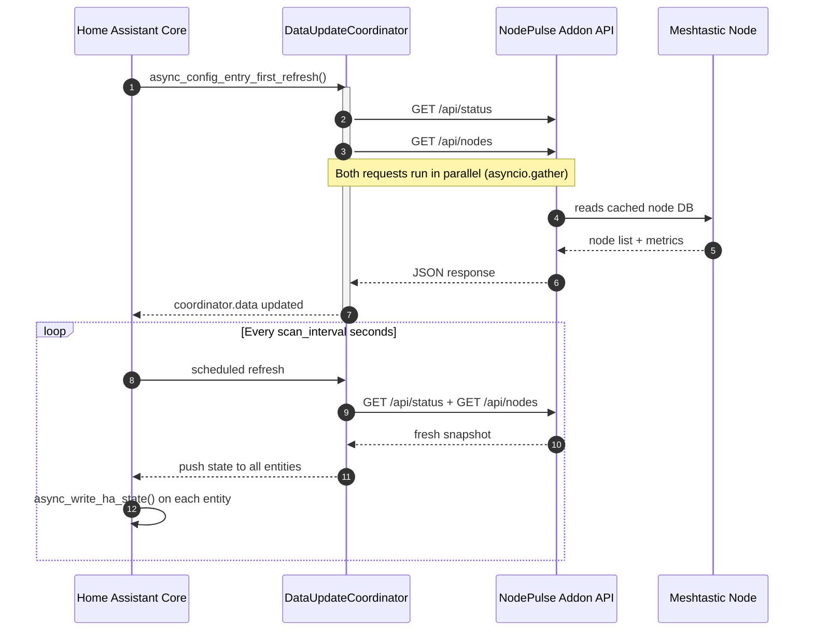
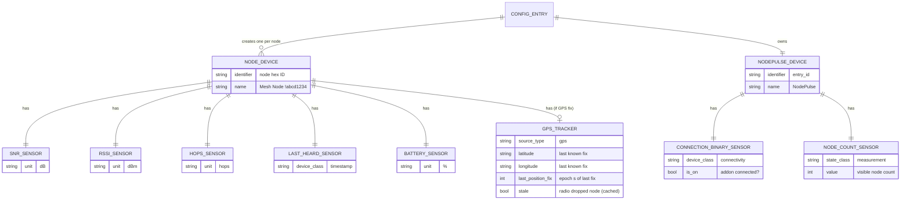

<div align="center">
  
  <h1>NodePulse</h1>
</div>

**Real-time Meshtastic mesh network monitoring for Home Assistant.**

NodePulse is a Home Assistant addon and custom integration that gives you deep visibility into your Meshtastic mesh network — node health, signal metrics, GPS positions on the HA map, and encrypted direct messaging — all from inside Home Assistant.

> NodePulse is an independent, from-scratch implementation for monitoring Meshtastic networks inside Home Assistant.

---

## Screenshots

<div align="center">
  
</div>

---

## Features

| Feature | Description |
|---|---|
| 🟢 **Connection Status** | Binary sensor — know immediately if your mesh link drops |
| 📡 **Node Count** | Live count of all visible mesh nodes |
| 📶 **Per-Node Metrics** | SNR, hops away, battery level, last heard — one HA device per node (RSSI is reported by the firmware as "Not provided" where unavailable) |
| 🗺️ **GPS Mapping** | Device trackers plotted on the native HA map card |
| 💬 **Messaging** | Send broadcast or DM messages via the Web UI; channel tabs appear immediately with real channel names, and the chat shows each sender's short name |
| 🔍 **Traceroute** | Dispatch traceroutes to any node from the Web UI (fire-and-forget — results appear on the next poll) |
| 🖥️ **Web UI Dashboard** | Full-featured dashboard served via HA Ingress, now mobile-friendly (slide-in nav drawer, responsive layout) |
| 📨 **Notify Platform** | `notify.mesh_<entry>` entity — send mesh messages from any automation/script, plus one `notify.mesh_<entry>_channel_<name>` entity per configured channel |
| ⚡ **Service Actions** | `nodepulse.send_message`, `nodepulse.request_position`, `nodepulse.trace_route` |
| 🤖 **Device Triggers & Actions** | Automate on message received/sent (and `channel_message.received`); send message / request position / trace route per node device |
| 📜 **Logbook** | Mesh messages recorded in the Home Assistant logbook timeline |
| 🗂️ **Persistent Node Store** | Every node ever seen is saved and re-shown even after the radio drops it from its bounded (~250) node DB; evicted nodes appear faded ("cached") and keep their last-known GPS position |
| 📍 **Last-Known-Position Retention** | Nodes that lose GPS or stop reporting keep their previous good fix on the map instead of vanishing; `last_position_fix` exposed per node |
| 🔎 **Map Node Filter** | Filter the map by name/ID, max hops away, last-heard window, or cached-only — with a live node count |
| 🏷️ **Node Tagging** | Comma-separated tags per node stored server-side; visible on node cards |
| 🧹 **Clear Stale Nodes** | One-click purge of cached (stale) nodes from the store via Settings |
| 🌓 **Dark/Light Theme** | Persistent theme toggle in the header |
| 📥 **Map Export (KML/GPX)** | Export visible GPS-fixed nodes as KML or GPX from the Map view |
| 📡 **Neighbor Info** | Per-node SNRs from NEIGHBORINFO_APP packets displayed on node cards |
| 🗺️ **Position History Trails** | GPS fix history (up to 200 fixes/node) persisted server-side, rendered as polylines on the map with toggle |
| 📊 **Airtime Trends** | Channel utilization & airtime utilization charts with a 30-minute rolling window |
| 🔍 **Message Search** | Free-text search across message history per conversation |
| 🎛️ **Collapsible Map Controls** | Collapse/expand overlay toggle buttons on the map |

---

## Architecture

### System Overview



### Poll Cycle — Data Flow



### HA Entity Model



### Node Storage & the Radio's 250-Node Limit

Meshtastic firmware keeps a **bounded node database (commonly ~250 entries)**. Once it is full, the oldest *heard* nodes are silently dropped from `interface.nodes`, so they would disappear from any monitoring tool — including NodePulse's node list, map, and HA entities.

NodePulse works around this:

- **Persistent store** — every node NodePulse has ever seen is written to `nodes.json` in the addon's data directory and survives addon restarts.
- **Re-injection** — on each poll, any node the radio no longer reports is re-added from the store, flagged `stale` (shown faded with a `cached` badge in the Web UI, and a `stale` attribute on the HA device tracker), and keeps its **last-known position** on the map.
- **New nodes** still appear immediately when first heard.
- **Clear stale nodes** — the Settings → Mesh panel has a **Clear stale nodes** button to purge the cached history on demand (e.g. after a mesh reshuffle), leaving only currently-heard nodes.

> This does **not** raise the radio's hard ~250 limit — it just ensures NodePulse remembers and re-displays nodes the radio forgets, so your visible count can exceed 250.

### Map Filtering

The full Map view has a filter bar to narrow the displayed nodes:

| Control | Behaviour |
|---|---|
| Search box | Substring match on short name, long name, or node ID (case-insensitive) |
| Max hops | Show only nodes with `hops_away ≤ N` (Any / 0 / 1 / 2 / 3 / 4 / 5+) |
| Heard within | Only nodes heard within 15 min / 1 h / 6 h / 24 h, or **Cached only** (stale nodes) |
| "N shown" | Live count of nodes passing the current filter; updates on filter changes and every poll |

The filter applies to both the dashboard mini-map and the full map.

---

## Installation

Because NodePulse consists of both an Addon and an Integration, **both pieces must be installed**.

### 1. Install the Addon (Home Assistant Store)

The easiest way to install the addon is directly from this GitHub repository:

1. In Home Assistant, go to **Settings → Add-ons → Add-on Store**.
2. Click the three vertical dots (⋮) in the top right and select **Repositories**.
3. Add this repository URL: `https://github.com/garethmo/NodePulse`
4. Close the modal, and wait a moment for the store to refresh.
5. Scroll down to find the **NodePulse Addon Repository**, and click **NodePulse**.
6. Click **Install**.
7. Configure the addon options and start it.

*(For developers: to install locally without the repo, copy the `nodepulse-addon` folder to your `/addons` directory).*

### 2. Install the Custom Integration (HACS)

The easiest way to install the integration is via [HACS](https://hacs.xyz/):

1. Open **HACS** in Home Assistant.
2. Click the three dots (⋮) in the top right and select **Custom repositories**.
3. Add `https://github.com/garethmo/NodePulse` as an **Integration**.
4. Click **Download** on the NodePulse integration.
5. Restart Home Assistant.
6. Go to **Settings → Integrations → Add Integration** and search for **NodePulse**.
5. Enter the addon URL. The default value (`http://a0d7b954-nodepulse:8099`) represents the addon's supervisor DNS name.
   - **Important:** If you installed NodePulse as a local addon (by copying it to the `addons` folder), its internal DNS name is actually `http://local_nodepulse_addon:8099`.
   - The integration features auto-discovery and will try both standard and local DNS names automatically. You can simply **leave the default value or leave it blank** and click Submit.
   - Do **not** use `http://localhost:8099` — from the integration's point of view, `localhost` is Home Assistant itself, not the addon container.

---

## Addon Configuration

NodePulse reaches your Meshtastic node over TCP. Because Meshtastic
**firmware allows only ONE TCP client per node**, you must choose how
NodePulse shares (or owns) that single connection.

### Connection modes

| Mode | `connection_type` | Connects to | Use when |
|---|---|---|---|
| **Direct** (default) | `direct` | the Meshtastic node itself | NodePulse is the only TCP client on the node |
| **Proxy** | `proxy` | the official Meshtastic HA integration's TCP proxy | you also run the official Meshtastic integration and want both to share the node |

> ⚠️ **One-TCP-client limit:** the Meshtastic node firmware permits a
> single TCP connection. The official Meshtastic integration (TCP) and
> NodePulse (TCP) **cannot both connect directly to the same node**.
> Either run NodePulse in `direct` mode with the official integration
> disabled, or run NodePulse in `proxy` mode (below).

### Proxy mode (coexist with the official integration)

The official Meshtastic integration can expose a **TCP Proxy** that owns the
node's single connection and relays framed packets to multiple clients. To use it:

1. In the official Meshtastic integration, enable the **TCP Proxy** option
   (default port `4403`).
2. Set NodePulse's options:
   - `connection_type`: `proxy`
   - `proxy_host`: **`homeassistant`** — the Docker DNS name of the
     Home Assistant Core container. Do **not** use the node's LAN IP; the
     proxy runs *inside* Core, not on the node, so it is not reachable
     via the node's address.
   - `proxy_port`: `4403` (must match the integration's proxy port).

> 📝 Proxy mode depends on the official integration's proxy implementation.
> If the proxy is flaky, fall back to `direct` mode with the official
> integration disabled.

### Options reference

| Option | Type | Default | Description |
|---|---|---|---|
| `connection_type` | `direct` \| `proxy` | `direct` | How NodePulse reaches the node (see above) |
| `meshtastic_host` | string | — | **Direct mode:** IP/hostname of your Meshtastic node |
| `meshtastic_port` | int | `4403` | **Direct mode:** TCP port of the node's Meshtastic interface |
| `proxy_host` | string | _(empty)_ | **Proxy mode:** host running the official integration (`homeassistant`) |
| `proxy_port` | int | `4403` | **Proxy mode:** TCP proxy port (must match the integration) |
| `access_key` | string | _(empty)_ | Optional access key if your node requires authentication. Can be set in **either** the addon options or the integration setup — both are relayed to the addon's node connection. Requires a meshtastic library version that supports access keys; ignored otherwise. |
| `scan_interval` | int | `30` | How often (seconds) the integration polls the addon (10–300) |
| `ignored_nodes` | list | `[]` | List of node hex IDs to exclude from all API responses |

> 💡 After changing `connection_type` (or any add-on option), **uninstall and
> re-install** the add-on so Home Assistant re-reads `config.json` and
> surfaces the new fields — a plain restart does not refresh the schema.

---

## Troubleshooting

### "Track in HA" toggle fails (502) / addon logs `404: Not Found` on `/api/nodepulse/*`

The addon relays the track request to Home Assistant core, which only answers
if the **NodePulse custom integration is loaded**. A `404` here means HA has no
`/api/nodepulse/track` (or `/api/nodepulse/tracked-nodes`) route yet.

1. Confirm `custom_components/nodepulse/` is inside your HA `config/custom_components/` directory.
2. Restart Home Assistant, then add the **NodePulse** integration via **Settings → Integrations → Add Integration**.
3. Verify in the HA logs that the relay views registered:
   `Registered NodePulse HTTP relay views at /api/nodepulse/track and /api/nodepulse/tracked-nodes`
4. Once the integration is loaded, the addon's `GET /api/tracked-nodes` and `POST /api/track-node` 502s resolve automatically.

> 💡 The addon and the integration are **separate pieces**. Installing the addon
> alone is not enough — the integration must also be installed and set up in HA,
> since only it can register entities and serve the `/api/nodepulse/*` endpoints.

### Integration shows "cannot_connect" (setup fails)

The integration runs **inside Home Assistant core** and must reach the addon
over the supervisor network. `localhost:8099` from the integration means HA
itself, not the addon container.

1. The integration uses auto-discovery. You can leave the host field as the default value (`http://a0d7b954-nodepulse:8099`) or blank, and it will automatically try known supervisor DNS names (`addon_nodepulse`, `local-nodepulse`, `nodepulse`, etc.) plus the port variations.
2. Do **not** use `http://localhost:8099` or the ingress `https://<ha>/api/hassio_ingress/...` URL — the integration is a Python client, not a browser, and cannot use the ingress proxy.
3. During setup the integration probes every candidate and **persists the exact host that responded**, so the runtime coordinator always reconnects to the same reachable address (no more "No NodePulse addon host was reachable" errors). If you set up an older version, re-run the integration setup (or re-add the entry) to store the corrected host.
4. Confirm the addon shows `connected: true` in its own log (Settings →
   Add-ons → NodePulse → Log) before adding the integration. The integration's
   connectivity test only passes when the addon is already linked to a node.

### Compatibility notes

- **Home Assistant version** — NodePulse targets current HA releases. Recent builds removed the deprecated `hass.helpers` shortcut and switched to the module-level `async_load_platform`, so make sure you are on **0.2.31 or later** if you hit `AttributeError: 'HomeAssistant' object has no attribute 'helpers'` during setup.
- **Logbook errors** — If you see a `NameError: name 'entry' is not defined` in the logs, update to 0.2.31+, which fixes the mesh-message listener that writes logbook entries.
- **Node history** — The addon persists nodes, channels, traceroutes, tags, position history, and messages under its data directory (default `/data` in HAOS; override with `NODEPULSE_DATA_DIR`). To start fresh, stop the addon and delete `nodes.json` (or use **Settings → Clear stale nodes** to drop only cached entries).
- **Position history** — GPS position fixes are recorded (up to 200 per node) and rendered as trails on the map. Persisted to `position_history.json`.
- **Node tags** — User-defined tags (comma-separated) are stored per node in `tags.json` and survive restarts.

---

## Technology Stack

| Component | Technology | Rationale |
|---|---|---|
| Addon backend | Python 3.12 + `aiohttp` | Pure Python, async, no native compilation — fully HAOS compatible |
| Meshtastic client | `meshtastic` PyPI library | Official library, pure Python |
| Web UI charts | Chart.js (CDN) | No build toolchain inside Docker |
| Web UI mapping | Leaflet.js (CDN) | Dark-theme tile layer, no API key |
| HA Integration | Python 3.12 + HA Core APIs | Standard custom component stack |

---

## Development

### Running the addon locally (without HA)

```bash
cd nodepulse-addon/
# Edit dev_options.json with your node's IP address
pip install -r requirements.txt
python -m app.main
# Open http://localhost:8099/ui/index.html
```

---

## Contributing

- All code comments, docstrings, commit messages, and documentation **must be in English**.
- Follow the SOLID and DRY principles described in the project rules.
- Run existing code through a linter before submitting a PR.

---

## License

MIT © NodePulse Contributors
