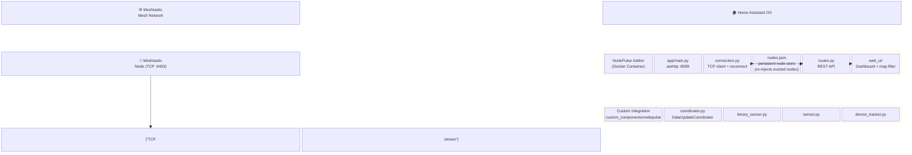

<h1>NodePulse</h1>

**Real-time Meshtastic mesh network monitoring for Home Assistant.**

NodePulse is a Home Assistant addon and custom integration that gives you deep visibility into your Meshtastic mesh network — node health, signal metrics, GPS positions on the HA map, and encrypted direct messaging — all from inside Home Assistant.

> NodePulse is an independent, from-scratch implementation for monitoring Meshtastic networks inside Home Assistant.

---

## Screenshots

---

## Features

| Feature | Description |
|---|---|
| 🟢 **Connection Status** | Binary sensor — know immediately if your mesh link drops |
| 📡 **Node Count** | Live count of all visible mesh nodes |
| 📶 **Per-Node Metrics** | SNR, hops away, battery level, last heard — one HA device per node (RSSI is reported by the firmware as "Not provided" where unavailable) |
| 🗺️ **GPS Mapping** | Device trackers plotted on the native HA map card |
| 🌡️ **Coverage Heatmap** | Visual heatmap layer on the map showing signal strength (SNR) |
| 🕸️ **Network Topology** | Force-directed network graph visualizing nodes, roles, and connections (traceroutes & neighbors) with SNR coloring |
| 💬 **Messaging** | Send broadcast or DM messages via the Web UI; channel tabs appear immediately with real channel names, and the chat shows each sender's short name |
| 🔍 **Traceroute** | Dispatch traceroutes to any node from the Web UI (fire-and-forget — results appear on the next poll) |
| 🖥️ **Web UI Dashboard** | Full-featured dashboard served via HA Ingress, now mobile-friendly (slide-in nav drawer, responsive layout) |
| 📦 **Packet Inspector** | Real-time packet capture ring buffer showing every inbound Meshtastic packet with portnum, source/destination (with short names), channel, SNR, hop count, ACK status, and expandable JSON detail. Filter by portnum or node ID, export to JSON/CSV, and view live sniffer stats (packets/min, unique nodes, portnum distribution). |
| 📨 **Notify Platform** | `notify.mesh_<entry>` entity — send mesh messages from any automation/script, plus one `notify.mesh_<entry>_channel_<name>` entity per configured channel |
| ⚡ **Service Actions** | `nodepulse.send_message`, `nodepulse.request_position`, `nodepulse.trace_route` |
| 🤖 **Device Triggers & Actions** | Automate on message received/sent (and `channel_message.received`); send message / request position / trace route per node device |
| 📜 **Logbook** | Mesh messages recorded in the Home Assistant logbook timeline |
| 🗂️ **Persistent Node Store** | Every node ever seen is saved and re-shown even after the radio drops it from its bounded (~250) node DB; evicted nodes appear faded ("cached") and keep their last-known GPS position |
| 📍 **Last-Known-Position Retention** | Nodes that lose GPS or stop reporting keep their previous good fix on the map instead of vanishing; `last_position_fix` exposed per node |
| 🔎 **Map Node Filter** | Filter the map by name/ID, max hops away, last-heard window, or cached-only — with a live node count |
| 🏷️ **Node Tagging** | Comma-separated tags per node stored server-side; visible on node cards |
| 🧹 **Clear Stale Nodes** | One-click purge of cached (stale) nodes from the store via Settings |
| 🌓 **Dark/Light Theme** | Persistent theme toggle in the header |
| 📥 **Map Export (KML/GPX)** | Export visible GPS-fixed nodes as KML or GPX from the Map view |
| 📡 **Neighbor Info** | Per-node SNRs from NEIGHBORINFO_APP packets displayed on node cards |
| 🗺️ **Position History Trails** | GPS fix history (up to 200 fixes/node) persisted server-side, rendered as polylines on the map with toggle |
| 📊 **Airtime Trends** | Channel utilization & airtime utilization charts with a 30-minute rolling window |
| 🔍 **Message Search** | Free-text search across message history per conversation |
| 🎛️ **Collapsible Map Controls** | Collapse/expand overlay toggle buttons on the map |

---

## Architecture

### System Overview

---

## 📥 Installation

etc.