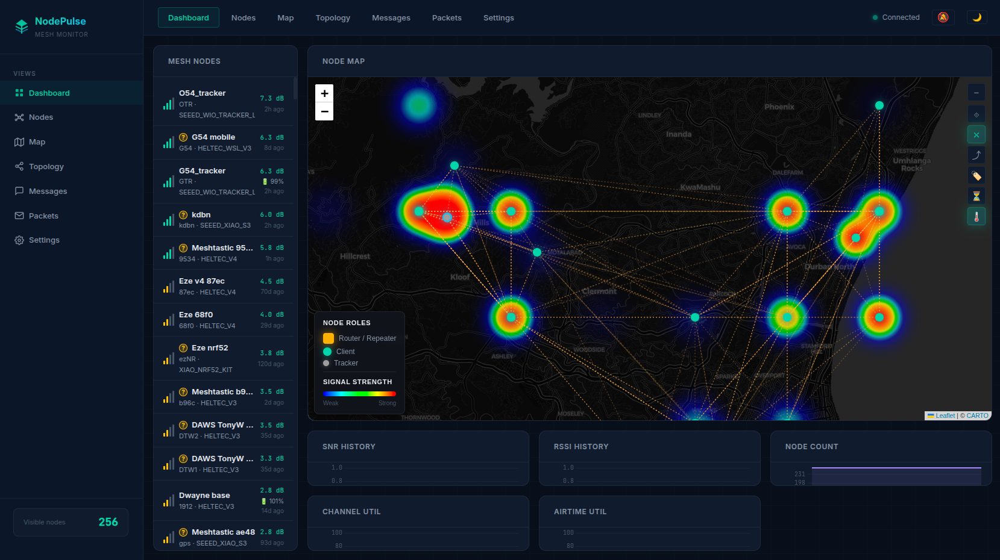
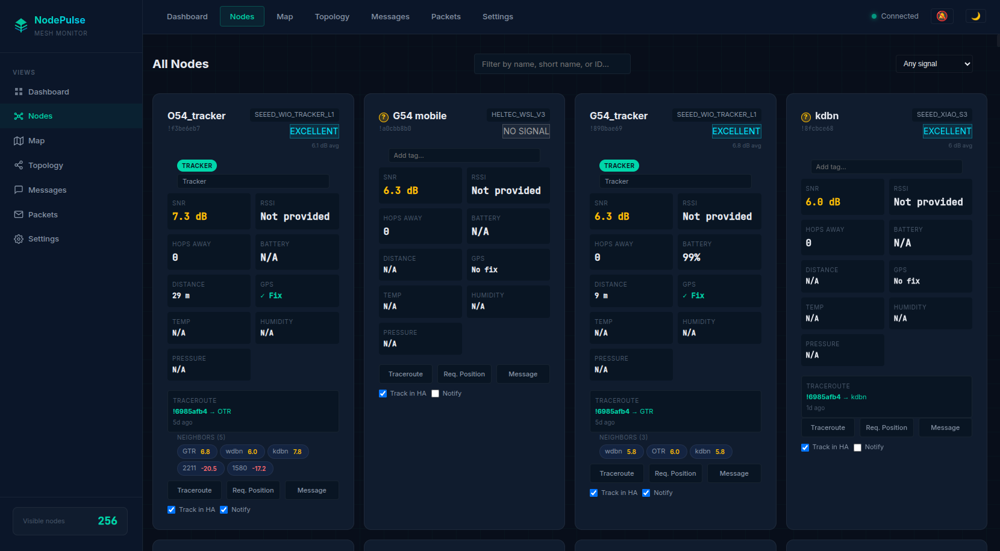
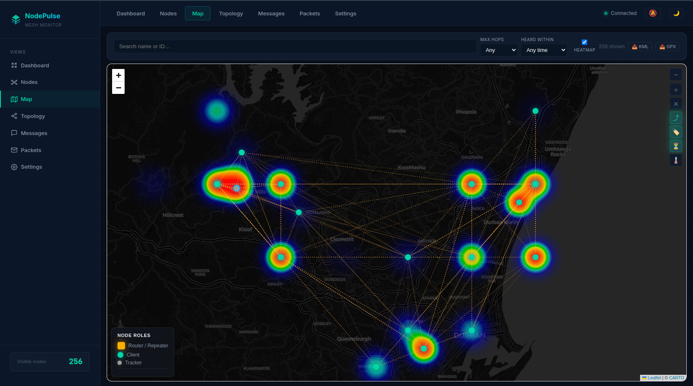
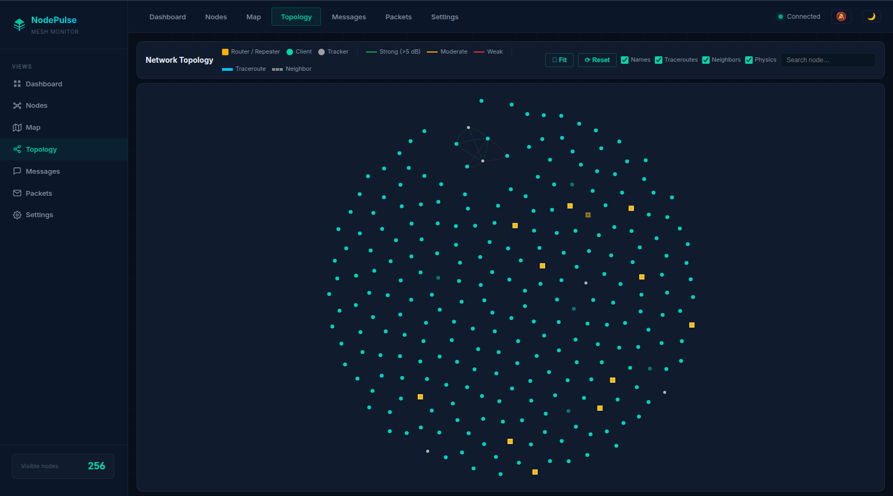
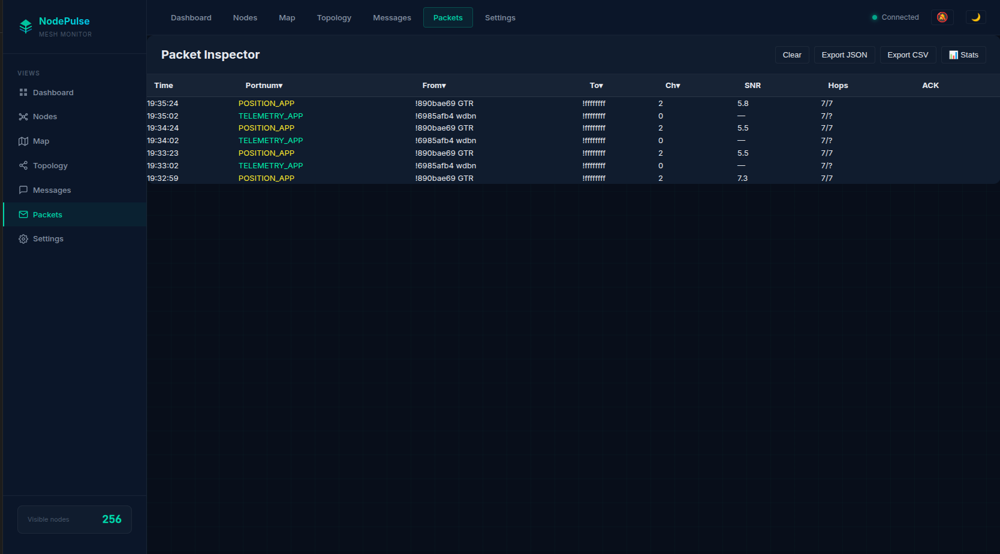
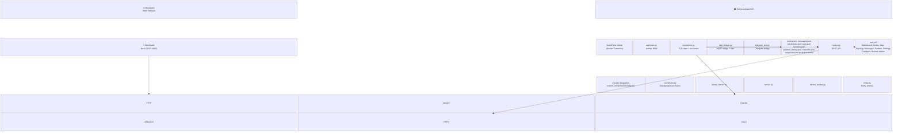
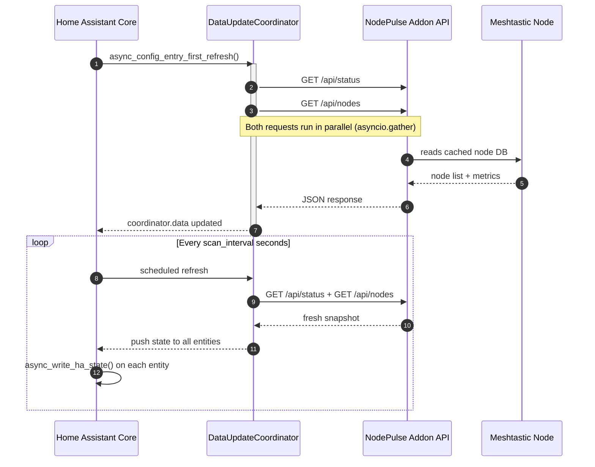

<div align="center">

<h1>NodePulse</h1>
</div>

**Real-time Meshtastic mesh network monitoring**

NodePulse is a Home Assistant addon and custom integration that gives you deep visibility into your Meshtastic mesh network node health, signal metrics, GPS positions on the HA map, packet inspection, and encrypted direct messaging all from inside Home Assistant.


---

## Screenshots

<details open>
<summary><b>Dashboard & Metrics</b></summary>
<br>
<div align="center">

</div>
</details>

<details>
<summary><b>Nodes Grid</b></summary>
<br>
<div align="center">

</div>
</details>

<details>
<summary><b>Map & Coverage Heatmap</b></summary>
<br>
<div align="center">

</div>
</details>

<details>
<summary><b>Network Topology</b></summary>
<br>
<div align="center">

</div>
</details>

<details>
<summary><b>Packet Inspector</b></summary>
<br>
<div align="center">

</div>
</details>

---

## Features

| Feature | Description |
|---|---|
| 🟢 **Connection Status** | Binary sensor — know immediately if your mesh link drops |
| 📡 **Node Count** | Live count of all visible mesh nodes |
| 📶 **Per-Node Metrics** | SNR, hops away, battery level, last heard — one HA device per node (RSSI is reported by the firmware as "Not provided" where unavailable) |
| 🗺️ **GPS Mapping** | Device trackers plotted on the native HA map card |
| 🌡️ **Coverage Heatmap** | Visual heatmap layer on the map showing signal strength (SNR) with dynamic gradient legend |
| 🗺️ **Map Base Layers** | Four selectable map styles: Dark (CartoDB), Light (CartoDB), **Satellite** (ESRI World Imagery), **Topographical** (OpenTopoMap). Toggle in top-left toolbar, persists across sessions. |
| 🕸️ **Network Topology** | Force-directed network graph visualizing nodes, roles, and connections (traceroutes & neighbors) with SNR coloring. Traceroute paths draw the full forward/return route (including relay hops shown as neutral placeholder nodes), neighbors fill in as dashed edges. Includes interactive toggles for node names, edges, physics, and a node search box |
| 💬 **Messaging** | Send broadcast or DM messages via the Web UI; channel tabs appear immediately with real channel names, and the chat shows each sender's short name |
| 🔍 **Traceroute** | Dispatch traceroutes to any node from the Web UI (fire-and-forget — results appear on the next poll) |
| 🖥️ **Web UI Dashboard** | Full-featured dashboard served via HA Ingress (no port forwarding). PWA-ready and fully mobile-optimized with slide-in navigation, responsive data tables, and tap-zoom protection. |
| 📦 **Packet Inspector** | Real-time packet capture ring buffer showing every inbound Meshtastic packet with portnum, source/destination (with short names), channel, SNR, hop count, ACK status, and expandable JSON detail. Sort/filter by column headers, export to JSON/CSV, and view live sniffer stats. Fully responsive on mobile screens. |
| 🔐 **Security Scanner** | Auto-detect weak or duplicate encryption keys across mesh channels with instantaneous server-side classification. Displays findings and highlights unencrypted/weak packets inline in the Packet Inspector. |
| 📨 **Notify Platform** | `notify.nodepulse` entity — send mesh messages from any automation/script, plus one `notify.nodepulse_<name>` entity per configured channel |
| ⚡ **Service Actions** | `nodepulse.send_message`, `nodepulse.request_position`, `nodepulse.trace_route` |
| 🤖 **Device Triggers & Actions** | Automate on message received/sent (and `channel_message.received`); send message / request position / trace route per node device |
| 📜 **Logbook** | Mesh messages recorded in the Home Assistant logbook timeline |
| 🗂️ **Persistent Node Store** | Every node ever seen is saved and re-shown even after the radio drops it from its bounded (~250) node DB; evicted nodes appear faded ("cached") and keep their last-known GPS position |
| 📍 **Last-Known-Position Retention** | Nodes that lose GPS or stop reporting keep their previous good fix on the map instead of vanishing; `last_position_fix` exposed per node |
| 🔎 **Map Node Filter** | Filter the map by name/ID, max hops away, last-heard window, or cached-only — with a live node count |
| 🏷️ **Node Tagging** | Comma-separated tags per node stored server-side; visible on node cards |
| 🧹 **Clear Stale Nodes** | One-click purge of cached (stale) nodes from the store via Settings |
| 🗑️ **Delete Single Node** | Remove any individual node from the persistent store via the red "Delete" button on its card, with confirmation prompt |
| 🌓 **Dark/Light Theme** | Persistent theme toggle in the header |
| 📥 **Map Export (KML/GPX)** | Export visible GPS-fixed nodes as KML or GPX from the Map view |
| 📍 **Waypoints** | Capture and display mesh-broadcast WAYPOINT_APP packets as amber teardrop markers on the map, plus locally create/delete waypoints with name, description, and emoji icon via a floating panel (GPS optional — defaults to map centre). Markers are draggable to reposition. Persisted in `waypoints.json` and surviving restarts |
| 📏 **Ruler** | Click-to-measure point-to-point distances on the map with dashed polylines and live distance labels. Samples elevation from node position history and displays total distance, elevation gain/loss, and a canvas-drawn elevation profile chart. Map toolbar auto-minimises when active |
| ⛰️ **Terrain Link Analysis** | Point-to-point LOS / Fresnel-zone / link-budget analysis between two nodes over real terrain (DEM elevation, default OpenTopoData SRTM30m). Reports earth-bulge-corrected Fresnel clearance, free-space path loss, effective received signal, and verdicts, with a canvas profile chart of the terrain cross-section, LOS beam, and Fresnel band |
| 🏔️ **3D Terrain View** | Switch the Map view to a 3D terrain map (MapLibre GL, loaded on demand) with AWS Terrain Tiles elevation, hillshading, and extruded node markers |
| 📡 **Neighbor Info** | Per-node SNRs from NEIGHBORINFO_APP packets displayed on node cards |
| 🗺️ **Position History Trails** | GPS fix history (up to 200 fixes/node) persisted server-side, rendered as polylines on the map with toggle |
| 📊 **Airtime Trends** | Channel utilization & airtime utilization charts with a 30-minute rolling window |
| 🔍 **Message Search** | Free-text search across message history per conversation |
| 🎛️ **Collapsible Map Controls** | Collapse/expand overlay toggle buttons on the map |
| 🐳 **Standalone Docker** | Run NodePulse completely independently of Home Assistant using the `Dockerfile.standalone` container |
| 🎚️ **Node Signal Filter** | Filter the nodes grid by signal strength (Excellent, Good, Fair, Poor) using a stable rolling `snr_avg` calculation |
| ☁️ **MQTT Bridge** | Built-in bidirectional MQTT bridge. Ingests traffic from external brokers with a robust geospatial/portnum/node-ID filter pipeline. Optionally forwards packets to the local radio. Includes Web UI configuration. |
| 🤖 **Telegram Bot** | Bidirectional Telegram Bot bridge. Inbound mesh text messages are automatically forwarded to an authorized Telegram chat. Send broadcasts or DMs back to the mesh from Telegram using bot commands. Includes `/status`, `/nodes`, `/channels`, `/send`, `/dm`, and `/help` commands. Zero extra dependencies — uses the built-in `aiohttp` library. |
| 🎛️ **Comprehensive Settings Page** | The Web UI Settings tab reflects every addon configuration option in real time — connection & mesh status, HA integration keys and token validation, the full MQTT bridge config (broker port, credential status, topic, geo filter, portnum allowlist, node blocklist), the Telegram bot (status, token, authorized chats, relay channels/DMs, commands), the auto responder, scan interval, and log level. Secrets are always masked |
| ⚙️ **Remote Device Configuration** | Configure tab to view and edit the connected mesh radio's config (roles, LoRa, WiFi, MQTT, telemetry, owner names). Schema-driven forms, backend-validated ranges/enums, danger-zone confirmations (ROUTER role, TX disabled, region, credentials), LoRa preset gating, and reboot-required feedback |
| 📢 **MeshBeacon Config (2.8+)** | New Mesh Beacon section: Listen/Broadcast/Legacy-Split toggles, beacon message (100 bytes), offer/TX channel-region-preset, broadcast interval (min 1h). Greyed out on firmware < 2.8.0 |
| 📝 **Status Message (2.8+)** | Text status string for UI display |
| 🎯 **TAK / ATAK (2.8+)** | Team (16 colors) + Role (100+ ATAK roles) dropdowns |
| 🚦 **Traffic Management (2.8+)** | Per-module enable/disable toggles (21 modules: MQTT, Serial, MeshBeacon, TAK, Status Message, etc.) |
| 💡 **Ambient Lighting (2.8+)** | LED strip control: GPIO, count, type, brightness (0–255), pattern, color, speed |
| 📻 **LoRa Regions (2.8+)** | +11 new regions: EU_N_868, EU_866, EU_874, EU_917, ITU1/2/3_2M (2m amateur), ITU1/2/3_70CM (70cm amateur), ITU2_125CM (1.25m amateur) |
| 📻 **LoRa Presets (2.8+)** | +7 new presets: LITE_FAST/SLOW (EU 866MHz), NARROW_FAST/SLOW (EU 868MHz narrow), TINY_FAST/SLOW (20kHz amateur, TCXO req), MEDIUM_TURBO (500kHz) |
| 🎭 **New Device Roles (2.8+)** | TAK, CLIENT_HIDDEN, LOST_AND_FOUND, TAK_TRACKER, ROUTER_LATE, CLIENT_BASE |
| 🔄 **RebroadcastMode (2.8+)** | ALL, ALL_SKIP_DECODING, LOCAL_ONLY, KNOWN_ONLY, NONE, CORE_PORTNUMS_ONLY |
| 🔔 **BuzzerMode (2.8+)** | ALL_ENABLED, DISABLED, NOTIFICATIONS_ONLY, SYSTEM_ONLY, DIRECT_MSG_ONLY |
| ⭐ **Favorite Nodes** | Star (★) button on node cards in Nodes view. Favorites pinned to top, then nodes with signal, then by recency. **Persisted server-side** in `favorites.json` (plus `GET/PUT /api/favorites`) so favorites survive reloads even when the HA addon iframe clears `localStorage`. Toast on toggle. |
| 🔍 **Auto Traceroute** | Automatically dispatches traceroute when a new node is discovered. Background thread, non-blocking, 300s timeout, respects serialization. Toggle in Settings → Auto Responder (`auto_traceroute_enabled`, default `false`). |
| ⏱ **Traceroute Timeout Feedback** | When a traceroute times out (300s), the node card shows "⏱ Timed out — no route discovered" with a relative timestamp; the map and topology pages skip timeout records instead of drawing bogus edges |
| 🗄️ **Persisted Traceroutes** | Discovered routes are stored in `traceroutes.json` and survive addon restarts. Traceroute targets evicted from the radio's bounded node DB are re-injected (as stale) so the topology page keeps drawing their links — even while the radio is offline |
| 🛰️ **Remote Node Administration** | New Remote Admin view administers OTHER mesh nodes over the Meshtastic AdminModule (requires admin capability on the gateway — an ADMIN channel or Security admin keys): read/edit their full config (schema-driven forms), set the owner, reboot/shutdown with a delay, factory reset (config or full device), reset the remote NodeDB, set/clear a fixed position, sync the clock, and evict nodes from the remote NodeDB. Every admin round-trip is bounded by a timeout so a dead node can't hang the app. |
| 🏷️ **Node Role Display** | Each node card now shows the node's role (CLIENT, ROUTER, REPEATER, TRACKER, etc.) in its metrics grid, making it easy to spot nodes serving special functions in the mesh |
| 🕒 **Last Heard Metric** | Node cards show a relative "Last Heard" timestamp (e.g. "2m ago", "1h ago") to quickly identify inactive or stale nodes |
| 📍 **Position Request Feedback** | The "Req. Position" button enters a loading state ("⏳ Requesting...") and auto-refreshes node data on response, with a 30s timeout so it always returns to a usable state |
| ⭐ **Device Favorites (NodeDB)** | Favoriting a node in the UI now also sends an admin message marking it as a favorite in the device's NodeDB — so communication with that node no longer counts against hop limits (same behaviour as the Meshtastic Android app) |
| 🔧 **Traceroute Path Fix** | Fixed traceroute path construction on node cards and map to properly handle different firmware versions, preventing duplicate nodes in the path and ensuring correct multi-hop visualization |
| 🔍 **Message Search Pagination** | Fixed "Load previous days" button not appearing when searching messages. Users can now expand the time window to find older matching messages |
| 📜 **Enhanced Message History** | Hybrid storage system keeps 1000 recent messages in memory (up from 200) and automatically archives older messages to date-based files, providing unlimited message history access with "No more messages available" indicator showing oldest message date |
| 🛡️ **Concurrency & Lock Safety (1.22.0)** | Strict lock hierarchy enforcement, deadlock-free background thread dispatching, snapshotted interface I/O, 503 terrain service contracts, and robust unit test coverage across all async pipelines |
| 📍 **Robust Location Sync (1.23.0)** | Direct Home Assistant state machine injection bypassing cached property conflicts for instant `device_tracker` and `geo_location` coordinate resolution |

---

## Architecture

### System Overview


```mermaid
block-beta
  columns 3

  Mesh["🌐 Meshtastic\nMesh Network"] space:1 HA["🏠 Home Assistant OS"]

  space:3

  Node["📡 Meshtastic\nNode (TCP :4403)"] space:1 block:addon:1
    addonLabel["NodePulse Addon\n(Docker Container)"]
    backend["app/main.py\naiohttp :8099"]
    conn["connection.py\nTCP client + reconnect"]
    mqtt["mqtt_bridge.py\nMQTT bridge + filter"]
    telegram["telegram_bot.py\nTelegram bridge"]
    store["nodes.json, messages.json,\ntraceroutes.json, tags.json,\nfavorites.json,\nposition_history.json, channels.json,\nwaypoints.json persistent stores"]
    routes["routes.py\nREST API"]
    ui["web_ui/\nDashboard, Nodes, Map,\nTopology, Messages, Packets, Settings,\nConfigure, Remote Admin"]
  end

  space:3

  space:1 space:1 block:integration:1
    intLabel["Custom Integration\ncustom_components/nodepulse"]
    coord["coordinator.py\nDataUpdateCoordinator"]
    bs["binary_sensor.py"]
    sens["sensor.py"]
    dt["device_tracker.py"]
    notify["notify.py\nNotify entities"]
  end

  Node -->|"TCP stream"| conn
  conn --> store
  store --> routes
  conn --> routes
  conn -->|"packet callbacks"| mqtt
  conn -->|"packet callbacks"| telegram
  routes --> ui
  routes -->|"REST relay"| coord
```

### Poll Cycle — Data Flow


```mermaid
sequenceDiagram
  autonumber
  participant HA  as Home Assistant Core
  participant C   as DataUpdateCoordinator
  participant API as NodePulse Addon API
  participant M   as Meshtastic Node

  HA->>C: async_config_entry_first_refresh()
  activate C
  C->>API: GET /api/status
  C->>API: GET /api/nodes
  Note over C,API: Both requests run in parallel (asyncio.gather)
  API->>M: reads cached node DB
  M-->>API: node list + metrics
  API-->>C: JSON response
  C-->>HA: coordinator.data updated
  deactivate C

  loop Every scan_interval seconds
    HA->>C: scheduled refresh
    C->>API: GET /api/status + GET /api/nodes
    API-->>C: fresh snapshot
    C-->>HA: push state to all entities
    HA->>HA: async_write_ha_state() on each entity
  end
```

### HA Entity Model


```mermaid
erDiagram
  CONFIG_ENTRY ||--o{ NODE_DEVICE : "creates one per tracked node"
  CONFIG_ENTRY ||--|| NODEPULSE_DEVICE : "owns"

  NODEPULSE_DEVICE {
    string identifier  "entry_id"
    string name        "NodePulse"
  }

  NODEPULSE_DEVICE ||--|| CONNECTION_BINARY_SENSOR : has
  NODEPULSE_DEVICE ||--|| NODE_COUNT_SENSOR : has

  CONNECTION_BINARY_SENSOR {
    string device_class  "connectivity"
    bool   is_on         "addon connected?"
  }

  NODE_COUNT_SENSOR {
    string state_class  "measurement"
    int    value        "visible node count"
  }

  NODE_DEVICE {
    string identifier  "node hex ID"
    string name        "Mesh Node !abcd1234"
  }

  NODE_DEVICE ||--|| SNR_SENSOR : has
  NODE_DEVICE ||--|| HOPS_SENSOR : has
  NODE_DEVICE ||--|| LAST_HEARD_SENSOR : has
  NODE_DEVICE ||--|| BATTERY_SENSOR : has
  NODE_DEVICE ||--|| VOLTAGE_SENSOR : has
  NODE_DEVICE ||--|| CHANNEL_UTIL_SENSOR : has
  NODE_DEVICE ||--|| AIR_UTIL_SENSOR : has
  NODE_DEVICE ||--|| UPTIME_SENSOR : has
  NODE_DEVICE ||--|| ROLE_SENSOR : has
  NODE_DEVICE ||--o| GPS_TRACKER : "has (if GPS fix)"
  NODE_DEVICE ||--|| ONLINE_BINARY_SENSOR : has
  NODE_DEVICE ||--o| LAST_MESSAGE_RECEIVED_SENSOR : has
  NODE_DEVICE ||--o| LAST_MESSAGE_SENT_SENSOR : has

  SNR_SENSOR           { string unit "dB" }
  HOPS_SENSOR          { string unit "hops" }
  LAST_HEARD_SENSOR    { string device_class "timestamp" }
  BATTERY_SENSOR       { string unit "%" }
  VOLTAGE_SENSOR       { string unit "V" }
  CHANNEL_UTIL_SENSOR  { string unit "%" }
  AIR_UTIL_SENSOR      { string unit "%" }
  UPTIME_SENSOR        { string unit "s" }
  ROLE_SENSOR          { string unit "" }
  ONLINE_BINARY_SENSOR { string device_class "connectivity" }
  GPS_TRACKER          { string source_type "gps" }
```

---

## Installation

Because NodePulse consists of both an **addon** and an **integration**, both pieces must be installed.

### 1. Install the Addon (Home Assistant Add-on Store)

1. In Home Assistant, go to **Settings → Add-ons → Add-on Store**.
2. Click the three vertical dots (⋮) in the top right and select **Repositories**.
3. Add this repository URL: `https://github.com/garethmo/NodePulse`
4. Close the modal and wait for the store to refresh.
5. Scroll down to **NodePulse Addon Repository** and click **NodePulse**.
6. Click **Install**.
7. Configure the addon options and start it.

*(For developers: copy the `nodepulse-addon` folder to your `/addons` directory for local installation.)*

### 2. Install the Custom Integration (HACS)

1. Open **HACS** in Home Assistant.
2. Click the three dots (⋮) in the top right and select **Custom repositories**.
3. Add `https://github.com/garethmo/NodePulse` as an **Integration**.
4. Click **Download** on the NodePulse integration.
5. Restart Home Assistant.
6. Go to **Settings → Integrations → Add Integration** and search for **NodePulse**.
7. Enter the addon URL. The default value (`http://a0d7b954-nodepulse:8099`) represents the addon's supervisor DNS name.
   - If you installed NodePulse as a local addon, the DNS name is `http://local_nodepulse_addon:8099`.
   - The integration features auto-discovery and will try both standard and local DNS names automatically. You can leave the default or leave it blank.
   - Do **not** use `http://localhost:8099` — from the integration's perspective, `localhost` is Home Assistant itself, not the addon container.

### 3. Dont have Home Assistant no worries - Standalone Docker (no Home Assistant required)

Run just the Web UI dashboard — all core features work without HA (dashboard, map, topology, messaging, packet inspector, etc.). See [STANDALONE_DOCKER.md](STANDALONE_DOCKER.md) for the full guide.

```bash
git clone https://github.com/garethmo/NodePulse.git
cd NodePulse/nodepulse-addon
docker build -t nodepulse:latest -f Dockerfile.standalone .
docker run -d --name nodepulse -p 8099:8099 -v /path/to/config.json:/app/dev_options.json:ro nodepulse:latest
```

Open **http://localhost:8099** in your browser.

---

## Addon Configuration

NodePulse reaches your Meshtastic node over TCP. Meshtastic firmware **allows only ONE TCP client per node**, so you must choose how NodePulse connects.

### Connection Modes

| Mode | `connection_type` | Connects to | Use when |
|---|---|---|---|
| **Direct** (default) | `direct` | the Meshtastic node itself | NodePulse is the only TCP client on the node |
| **Proxy** | `proxy` | the official Meshtastic HA integration's TCP proxy | Running both the official integration and NodePulse |

> ⚠️ The Meshtastic node firmware permits a single TCP connection. The official integration and NodePulse **cannot both connect directly to the same node**. Either use `direct` mode with the official integration disabled, or use `proxy` mode.

### Proxy Mode (coexist with the official integration)

The official Meshtastic integration can expose a **TCP Proxy** that owns the node's single connection:

1. In the official integration, enable the **TCP Proxy** option (default port `4403`).
2. Set NodePulse options:
   - `connection_type`: `proxy`
   - `proxy_host`: `homeassistant` (Docker DNS name of HA Core — not the node's LAN IP)
   - `proxy_port`: `4403` (must match the integration's proxy port)

### Options Reference

| Option | Type | Default | Description |
|---|---|---|---|
| `connection_type` | `direct` \| `proxy` | `direct` | How NodePulse reaches the node |
| `meshtastic_host` | string | — | **Direct mode:** IP/hostname of your Meshtastic node |
| `meshtastic_port` | int | `4403` | **Direct mode:** TCP port of the node's Meshtastic interface |
| `proxy_host` | string | _(empty)_ | **Proxy mode:** host running the official integration (`homeassistant`) |
| `proxy_port` | int | `4403` | **Proxy mode:** TCP proxy port |
| `access_key` | string | _(empty)_ | Optional access key if your node requires authentication |
| `scan_interval` | int | `30` | How often (seconds) the integration polls the addon (10–300) |
| `ignored_nodes` | list | `[]` | List of node hex IDs to exclude from all API responses |
| `ha_base_url` | string | _(auto)_ | Override the Home Assistant base URL for track-in-HA relay |
| `ha_access_token` | string | _(empty)_ | Long-lived HA access token that authenticates the Track-in-HA relay when `SUPERVISOR_TOKEN` is missing or rejected. The Supervisor token is tried first (HAOS); if HA core rejects it (missing/mismatched), the relay retries with this token. Create it in HA under **Profile → Security → Long-lived access tokens**. |
| `disable_token_validation` | bool | `false` | **Deprecated (no-op)** — token validation is always on. Retained only for backward compatibility with existing configs. |

### MQTT Bridge Configuration

NodePulse includes an advanced, bidirectional MQTT Bridge capable of ingesting mesh traffic from an external broker (e.g., `mqtt.meshtastic.org`) and acting as a selective firewall to prevent distant public nodes from polluting your local mesh database.

| Option | Type | Default | Description |
|---|---|---|---|
| `mqtt_enabled` | bool | `false` | Enable the MQTT Bridge |
| `mqtt_address` | string | `mqtt.meshtastic.org` | Hostname/IP of the MQTT broker |
| `mqtt_port` | int | `1883` | TCP port of the broker |
| `mqtt_username` | string | `meshdev` | Username for authentication (leave empty for anonymous) |
| `mqtt_password` | string | `large4cats` | Password for authentication |
| `mqtt_topic` | string | `msh/+` | The topic to subscribe to |
| `mqtt_forwarding_enabled` | bool | `false` | **⚠️ ADVANCED:** Forward inbound MQTT packets out over your local radio link |

#### MQTT Filtering ("Mesh Firewall")

Because public brokers like `mqtt.meshtastic.org` carry thousands of global nodes, blindly ingesting all traffic will quickly overwhelm both NodePulse and your local radio if forwarding is enabled. NodePulse provides a 3-stage filter pipeline (processed in order of cost):

1. **Node Blocklist (`mqtt_node_blocklist`)**: A list of explicit node IDs (e.g., `!abcd1234`) to permanently ignore.
2. **PortNum Allowlist (`mqtt_portnum_allowlist`)**: Only packets matching these app types are permitted. For example, setting this to `["TEXT_MESSAGE_APP", "POSITION_APP", "NODEINFO_APP"]` drops all routing, telemetry, and neighbor-info packets. If left empty, all types are allowed.
3. **Geospatial Bounding Box (`mqtt_geo_filter_enabled`)**: 
   - Define a geographic fence using `mqtt_lat_min`, `mqtt_lat_max`, `mqtt_lng_min`, and `mqtt_lng_max`.
   - When a `POSITION_APP` packet arrives, it is dropped if it falls outside the box.
   - **Crucially**, NodePulse caches this "out-of-bounds" status per node. If a node is out-of-bounds, NodePulse drops *all subsequent packets* (messages, telemetry, etc.) from that node until it moves back inside the box. This prevents distant nodes from bypassing the geo-fence by sending non-position packets.

*(Note: The bounding box must be valid — `lat_min < lat_max` and `lng_min < lng_max` — or the geo-filter will automatically disable itself with a warning).*

---

### Telegram Bot Configuration

NodePulse includes a built-in Telegram Bot that bridges your Meshtastic mesh to a private Telegram chat. When enabled, inbound mesh messages are automatically forwarded to your Telegram chat and you can send messages back to the mesh using bot commands.

> ℹ️ **No extra dependencies required.** The bot uses `aiohttp`, which is already part of NodePulse's existing stack.

#### Step 1 — Create a Bot via BotFather

1. Open Telegram and search for **@BotFather**.
2. Send `/newbot` and follow the prompts to choose a name and username.
3. BotFather will reply with your **Bot Token** — it looks like: `7123456789:AAFxxxxxxxx_xxxxxxxxxxxxxxxxxx`.
4. Copy this token — you'll need it in the addon config.

#### Step 2 — Find Your Chat ID

Your **Chat ID** is the unique numeric identifier of your Telegram account or group that the bot is authorized to talk to.

**For a private chat (recommended):**
1. Start a conversation with your new bot by searching for its username and clicking **Start**.
2. Open a browser and visit:
   ```
   https://api.telegram.org/bot<YOUR_BOT_TOKEN>/getUpdates
   ```
3. Send any message to your bot from Telegram, then refresh the page.
4. Look for `"chat":{"id":XXXXXXXXX}` — that number is your Chat ID.

**For a group chat:**
1. Add the bot to the group.
2. Send a message in the group, then use the `getUpdates` URL above.
3. The group Chat ID will be a **negative** number (e.g. `-1001234567890`).

#### Step 3 — Configure the Addon

Set these options in the NodePulse addon configuration (HA UI → NodePulse → Configuration):

| Option | Type | Default | Description |
|---|---|---|---|
| `telegram_enabled` | bool | `false` | Enable the Telegram Bot integration |
| `telegram_bot_token` | string | _(empty)_ | Your BotFather-issued bot token |
| `telegram_chat_id` | string | _(empty)_ | Numeric ID of the authorized chat or group |
| `telegram_forward_channels` | string | `0` | Mesh channel indices whose messages are relayed to Telegram. Comma or space separated, e.g. `0, 1, 2` |
| `telegram_forward_dms` | bool | `true` | Whether inbound mesh DMs are also relayed to Telegram |
| `telegram_allow_commands` | bool | `true` | Allow sending commands from Telegram back to the mesh |

**Minimal working config:**
```json
{
  "telegram_enabled": true,
  "telegram_bot_token": "7123456789:AAFxxxxxxxx_xxxxxxxxxxxxxxxxxx",
  "telegram_chat_id": "123456789"
}
```

After saving, restart the addon. The Settings tab in the NodePulse Web UI will show **Telegram Bot: ✓ Enabled**.

#### Bot Command Reference

Once the bot is running, send these commands from your authorized Telegram chat:

| Command | Description |
|---|---|
| `/help` | List all available commands |
| `/status` | Show node name, online/offline state, last heard (relative time), uptime, battery, visible node count, and MAC address |
| `/nodes` | List the top 20 nodes by last-heard time, with their SNR |
| `/channels` | List the radio's configured channels with their indices |
| `/send <message>` | Broadcast a text message to the primary mesh channel (Ch 0) |
| `/send <ch> <message>` | Broadcast to a specific channel, e.g. `/send 1 Hello!` (or `/send #1 Hello!`) |
| `/dm !nodeid <message>` | Send a direct message to a specific node (e.g. `/dm !a1b2c3d4 Hello!`) |

#### Security Notes

- The bot **only processes messages from the configured `telegram_chat_id`**. Any message from any other chat is silently discarded. This means even if someone finds your bot's username, they cannot send commands to your radio.
- The `telegram_bot_token` is stored as an addon option. Keep it private and regenerate it with BotFather if it is ever leaked.
- Outgoing messages from the local node are **not** echoed back to Telegram to prevent relay loops.

---

## Web UI Settings Page

The **Settings** tab in the NodePulse dashboard reflects every addon configuration option in real time. It is read-only — values are edited in the Home Assistant add-on Configuration tab — but shows the complete live state so you can verify what the addon actually loaded. Settings are grouped into:

| Group | Contents |
|---|---|
| **Connection** | Link status, connection mode (Direct/Proxy), Meshtastic host & port, and proxy host & port (only shown in `proxy` mode) |
| **Mesh** | Visible node count, ignored node IDs, and a one-click **Clear stale nodes** action |
| **Home Assistant Integration** | HA base URL, access key (masked), and (deprecated) token-validation toggle |
| **MQTT Bridge** | Forwarding mode, broker address & port, username/password presence (masked), topic, geo-filter bounds, portnum allowlist, and node blocklist |
| **Telegram Bot** | Status, bot token (masked), authorized chat ID(s), relay channels, DM relay, and command permission |
| **Auto Responder** | Status and configured welcome message |
| **Schedule & Logging** | Scan interval and log level |
| **About** | NodePulse version |

Secrets are always masked (`●●●●●● (set)` / `Not set`), and rows for disabled features render as `—` rather than leaking empty config values.

---

## Security

See [SECURITY.md](./SECURITY.md) for the full threat model. Summary:

- **No host-port exposure** — The addon's REST API is not published to the host network; it is reachable only via HA Ingress (requires HA authentication) and the Supervisor network. This is intentional and keeps the unauthenticated addon API off your LAN.
- **Relay endpoints fail closed** — `/api/nodepulse/track` and `/api/nodepulse/tracked-nodes` require a matching `Authorization: Bearer <SUPERVISOR_TOKEN>` or valid Home Assistant authentication (a long-lived access token via the addon's `ha_access_token` option, or an HA session) — there is no anonymous path.
- **Mesh data is treated as untrusted** — Waypoint name/description/icon are sanitized server-side and HTML-escaped in the Web UI; the Web UI uses no inline event handlers for mesh-controlled values.
- **Telegram** — Inbound messages are filtered against the authorized chat IDs; unauthorized chats are dropped before any mesh action.
- **Threat model note** — The optional `access_key` authenticates to the Meshtastic node and travels in plaintext over HTTP. Prefer the Supervisor network (HAOS) or an isolated network for the addon↔integration link; do not expose the addon API to the open internet.

---

## Troubleshooting

### "Track in HA" toggle fails (502 / 401) or addon logs 404 on `/api/nodepulse/*`

The addon relays the track request to Home Assistant core, which only answers if the **NodePulse custom integration is loaded**. A 404 means HA has no `/api/nodepulse/track` route yet; a 401 means the relay was rejected by token validation.

1. Confirm `custom_components/nodepulse/` is inside your HA `config/custom_components/` directory.
2. Restart HA, then add the NodePulse integration via **Settings → Integrations → Add Integration**.
3. Verify in the HA logs that relay views registered.
4. Once the integration is loaded, the 502s resolve automatically.
5. **401 Unauthorized** — The relay validates a `Bearer` token against HA core and fails closed. The Supervisor token (injected on HAOS) is tried first; if it is missing or mismatched, the relay retries with the addon's `ha_access_token` (a long-lived HA access token, Profile → Security → Long-lived access tokens). Ensure both containers share `SUPERVISOR_TOKEN`, or set `ha_access_token`. The legacy `disable_token_validation` option no longer disables this check.

### Integration shows "cannot_connect" (setup fails)

1. The integration uses auto-discovery. Leave the host field as default or blank.
2. Do **not** use `http://localhost:8099` — from the integration, `localhost` is HA itself.
3. Confirm the addon shows `connected: true` in its log before adding the integration.

### Lost connection to mesh node

- The addon performs an active health probe every 60s. A dropped TCP session is detected and reconnected automatically.
- Fresh connections get a 30s grace period before an empty node DB is treated as a dead connection.

---

## Development

### Running the addon locally (without HA)

```bash
cd nodepulse-addon/
# Edit dev_options.json with your node's IP address
pip install -r requirements.txt
python -m app.main
# Open http://localhost:8099/ui/index.html
```

### Tech Stack

| Component | Technology |
|---|---|
| Addon backend | Python 3.12 + `aiohttp` |
| Meshtastic client | `meshtastic` PyPI library |
| Web UI charts | Chart.js (CDN) |
| Web UI mapping | Leaflet.js (CDN) |
| HA Integration | Python 3.12 + HA Core APIs |
| E2E Testing    | pytest + Playwright |

### Testing (E2E & API)

NodePulse includes a comprehensive testing framework with both unit tests and End-to-End (E2E) tests that validate the Python API, core modules, and Web UI in a headless browser.

**Running the tests:**
```bash
cd nodepulse-addon/
# Install test dependencies
pip install -r requirements-test.txt
playwright install chromium

# Run unit tests
python3 -m pytest tests/unit/ -v

# Run E2E tests
python3 -m pytest tests/e2e/ -v

# Run all tests with coverage reporting
python3 -m pytest tests/ --cov=app --cov-report=term-missing --cov-report=html -v
```

**Test Coverage:**
- **80 total tests** covering configuration management, security scanning, MQTT bridge filtering, API route handlers, and E2E API endpoints
- **100% pass rate** (80 passed, 0 failed) on GitHub Actions CI/CD pipeline
- **26% overall coverage** with 95%+ coverage on critical modules like `config.py` and `security_scanner.py`
- **Coverage reports** generated in both terminal and HTML format (`htmlcov/` directory)

**GitHub Actions CI/CD:**
- Automated testing on every push to main branch
- E2E test suite completes in ~52 seconds
- Validates both API endpoints and Web UI functionality in headless browser environment

**How it works:**
- **Unit Tests:** `tests/unit/` contains focused tests for individual modules (config, security_scanner, mqtt_bridge, routes) using mocks to isolate functionality
- **E2E Tests:** `tests/e2e/` validates the full API stack and Web UI integration using a headless browser
- **Mocks & Isolation:** The `tests/conftest.py` file fully mocks the backend Meshtastic hardware connection, MQTT bridge, Telegram bot, and Home Assistant integration relays. This ensures tests run quickly and deterministically without requiring actual radio hardware or a live HA instance.
- **Headless UI Tests:** `test_web_ui.py` uses Playwright to spin up a headless Chromium browser, navigate to the local `aiohttp` test server, and verify that the UI renders data correctly.
- **CDN Stubbing:** Because the UI relies on external CDNs for Leaflet, Chart.js, and vis-network (which can fail or time out in offline/headless environments), Playwright intercepts these requests and injects minimal mock JavaScript stubs into the page before it loads. This allows the UI logic to execute without crashing.
- **API Tests:** `test_api.py` verifies all JSON endpoints (`/api/nodes`, `/api/messages`, etc.) accurately reflect the mocked data state.

---

## Contributing

See [DEV.md](./DEV.md) for the contributor guide (architecture, lint/test
commands, and contribution checklist).

- All code comments, commit messages, and documentation must be in English.
- Run the linter before submitting a PR.

---

## License

MIT © NodePulse Contributors
