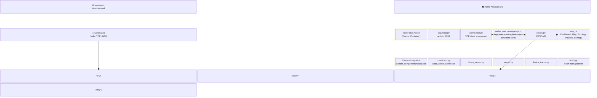
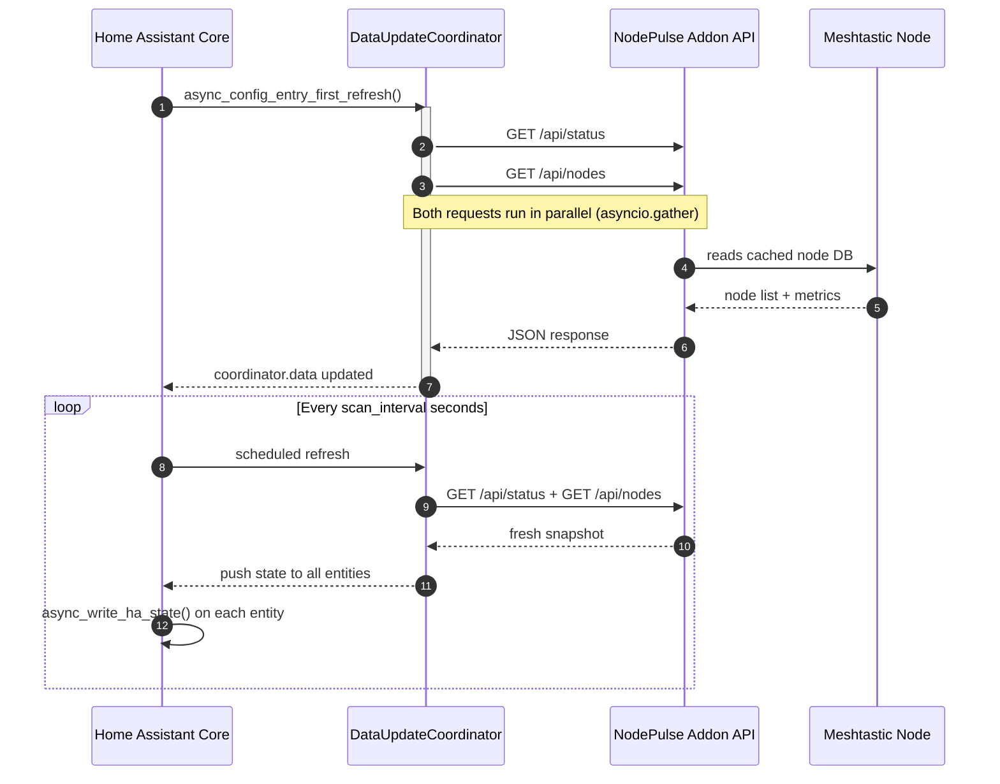

<div align="center">

<h1>NodePulse</h1>
</div>

**Real-time Meshtastic mesh network monitoring for Home Assistant.**

NodePulse is a Home Assistant addon and custom integration that gives you deep visibility into your Meshtastic mesh network — node health, signal metrics, GPS positions on the HA map, packet inspection, and encrypted direct messaging — all from inside Home Assistant.


---

## Screenshots

<div align="center">

</div>

---

## Features

| Feature | Description |
|---|---|
| 🟢 **Connection Status** | Binary sensor — know immediately if your mesh link drops |
| 📡 **Node Count** | Live count of all visible mesh nodes |
| 📶 **Per-Node Metrics** | SNR, hops away, battery level, last heard — one HA device per node (RSSI is reported by the firmware as "Not provided" where unavailable) |
| 🗺️ **GPS Mapping** | Device trackers plotted on the native HA map card |
| 🌡️ **Coverage Heatmap** | Visual heatmap layer on the map showing signal strength (SNR) with dynamic gradient legend |
| 🕸️ **Network Topology** | Force-directed network graph visualizing nodes, roles, and connections (traceroutes & neighbors) with SNR coloring. Includes interactive toggles for node names, edges, physics, and a node search box |
| 💬 **Messaging** | Send broadcast or DM messages via the Web UI; channel tabs appear immediately with real channel names, and the chat shows each sender's short name |
| 🔍 **Traceroute** | Dispatch traceroutes to any node from the Web UI (fire-and-forget — results appear on the next poll) |
| 🖥️ **Web UI Dashboard** | Full-featured dashboard served via HA Ingress (no port forwarding), mobile-friendly with slide-in nav drawer and responsive layout |
| 📦 **Packet Inspector** | Real-time packet capture ring buffer showing every inbound Meshtastic packet with portnum, source/destination (with short names), channel, SNR, hop count, ACK status, and expandable JSON detail. Sort/filter by column headers, export to JSON/CSV, and view live sniffer stats (packets/min, unique nodes, portnum distribution) |
| 📨 **Notify Platform** | `notify.mesh_<entry>` entity — send mesh messages from any automation/script, plus one `notify.mesh_<entry>_channel_<name>` entity per configured channel |
| ⚡ **Service Actions** | `nodepulse.send_message`, `nodepulse.request_position`, `nodepulse.trace_route` |
| 🤖 **Device Triggers & Actions** | Automate on message received/sent (and `channel_message.received`); send message / request position / trace route per node device |
| 📜 **Logbook** | Mesh messages recorded in the Home Assistant logbook timeline |
| 🗂️ **Persistent Node Store** | Every node ever seen is saved and re-shown even after the radio drops it from its bounded (~250) node DB; evicted nodes appear faded ("cached") and keep their last-known GPS position |
| 📍 **Last-Known-Position Retention** | Nodes that lose GPS or stop reporting keep their previous good fix on the map instead of vanishing; `last_position_fix` exposed per node |
| 🔎 **Map Node Filter** | Filter the map by name/ID, max hops away, last-heard window, or cached-only — with a live node count |
| 🏷️ **Node Tagging** | Comma-separated tags per node stored server-side; visible on node cards |
| 🧹 **Clear Stale Nodes** | One-click purge of cached (stale) nodes from the store via Settings |
| 🌓 **Dark/Light Theme** | Persistent theme toggle in the header |
| 📥 **Map Export (KML/GPX)** | Export visible GPS-fixed nodes as KML or GPX from the Map view |
| 📡 **Neighbor Info** | Per-node SNRs from NEIGHBORINFO_APP packets displayed on node cards |
| 🗺️ **Position History Trails** | GPS fix history (up to 200 fixes/node) persisted server-side, rendered as polylines on the map with toggle |
| 📊 **Airtime Trends** | Channel utilization & airtime utilization charts with a 30-minute rolling window |
| 🔍 **Message Search** | Free-text search across message history per conversation |
| 🎛️ **Collapsible Map Controls** | Collapse/expand overlay toggle buttons on the map |

---

## Architecture

### System Overview


```mermaid
block-beta
  columns 3

  Mesh["🌐 Meshtastic\nMesh Network"] space:1 HA["🏠 Home Assistant OS"]

  space:3

  Node["📡 Meshtastic\nNode (TCP :4403)"] space:1 block:addon:1
    addonLabel["NodePulse Addon\n(Docker Container)"]
    backend["app/main.py\naiohttp :8099"]
    conn["connection.py\nTCP client + reconnect"]
    store["nodes.json, messages.json,\ntags.json, position_history.json\npersistent stores"]
    routes["routes.py\nREST API"]
    ui["web_ui/\nDashboard, Map, Topology,\nPackets, Settings"]
  end

  space:3

  space:1 space:1 block:integration:1
    intLabel["Custom Integration\ncustom_components/nodepulse"]
    coord["coordinator.py\nDataUpdateCoordinator"]
    bs["binary_sensor.py"]
    sens["sensor.py"]
    dt["device_tracker.py"]
    notify["notify.py\nMesh notify platform"]
  end

  Node -->|"TCP stream"| conn
  conn --> store
  store --> routes
  conn --> routes
  routes --> ui
  routes -->|"REST relay"| coord
```

### Poll Cycle — Data Flow


```mermaid
sequenceDiagram
  autonumber
  participant HA  as Home Assistant Core
  participant C   as DataUpdateCoordinator
  participant API as NodePulse Addon API
  participant M   as Meshtastic Node

  HA->>C: async_config_entry_first_refresh()
  activate C
  C->>API: GET /api/status
  C->>API: GET /api/nodes
  Note over C,API: Both requests run in parallel (asyncio.gather)
  API->>M: reads cached node DB
  M-->>API: node list + metrics
  API-->>C: JSON response
  C-->>HA: coordinator.data updated
  deactivate C

  loop Every scan_interval seconds
    HA->>C: scheduled refresh
    C->>API: GET /api/status + GET /api/nodes
    API-->>C: fresh snapshot
    C-->>HA: push state to all entities
    HA->>HA: async_write_ha_state() on each entity
  end
```

### HA Entity Model


```mermaid
erDiagram
  CONFIG_ENTRY ||--o{ NODE_DEVICE : "creates one per tracked node"
  CONFIG_ENTRY ||--|| NODEPULSE_DEVICE : "owns"

  NODEPULSE_DEVICE {
    string identifier  "entry_id"
    string name        "NodePulse"
  }

  NODEPULSE_DEVICE ||--|| CONNECTION_BINARY_SENSOR : has
  NODEPULSE_DEVICE ||--|| NODE_COUNT_SENSOR : has

  CONNECTION_BINARY_SENSOR {
    string device_class  "connectivity"
    bool   is_on         "addon connected?"
  }

  NODE_COUNT_SENSOR {
    string state_class  "measurement"
    int    value        "visible node count"
  }

  NODE_DEVICE {
    string identifier  "node hex ID"
    string name        "Mesh Node !abcd1234"
  }

  NODE_DEVICE ||--|| SNR_SENSOR : has
  NODE_DEVICE ||--|| HOPS_SENSOR : has
  NODE_DEVICE ||--|| LAST_HEARD_SENSOR : has
  NODE_DEVICE ||--|| BATTERY_SENSOR : has
  NODE_DEVICE ||--|| VOLTAGE_SENSOR : has
  NODE_DEVICE ||--|| CHANNEL_UTIL_SENSOR : has
  NODE_DEVICE ||--|| AIR_UTIL_SENSOR : has
  NODE_DEVICE ||--|| UPTIME_SENSOR : has
  NODE_DEVICE ||--|| ROLE_SENSOR : has
  NODE_DEVICE ||--o| GPS_TRACKER : "has (if GPS fix)"
  NODE_DEVICE ||--|| ONLINE_BINARY_SENSOR : has
  NODE_DEVICE ||--o| LAST_MESSAGE_RECEIVED_SENSOR : has
  NODE_DEVICE ||--o| LAST_MESSAGE_SENT_SENSOR : has

  SNR_SENSOR           { string unit "dB" }
  HOPS_SENSOR          { string unit "hops" }
  LAST_HEARD_SENSOR    { string device_class "timestamp" }
  BATTERY_SENSOR       { string unit "%" }
  VOLTAGE_SENSOR       { string unit "V" }
  CHANNEL_UTIL_SENSOR  { string unit "%" }
  AIR_UTIL_SENSOR      { string unit "%" }
  UPTIME_SENSOR        { string unit "s" }
  ROLE_SENSOR          { string unit "" }
  ONLINE_BINARY_SENSOR { string device_class "connectivity" }
  GPS_TRACKER          { string source_type "gps" }
```

---

## Installation

Because NodePulse consists of both an **addon** and an **integration**, both pieces must be installed.

### 1. Install the Addon (Home Assistant Add-on Store)

1. In Home Assistant, go to **Settings → Add-ons → Add-on Store**.
2. Click the three vertical dots (⋮) in the top right and select **Repositories**.
3. Add this repository URL: `https://github.com/garethmo/NodePulse`
4. Close the modal and wait for the store to refresh.
5. Scroll down to **NodePulse Addon Repository** and click **NodePulse**.
6. Click **Install**.
7. Configure the addon options and start it.

*(For developers: copy the `nodepulse-addon` folder to your `/addons` directory for local installation.)*

### 2. Install the Custom Integration (HACS)

1. Open **HACS** in Home Assistant.
2. Click the three dots (⋮) in the top right and select **Custom repositories**.
3. Add `https://github.com/garethmo/NodePulse` as an **Integration**.
4. Click **Download** on the NodePulse integration.
5. Restart Home Assistant.
6. Go to **Settings → Integrations → Add Integration** and search for **NodePulse**.
7. Enter the addon URL. The default value (`http://a0d7b954-nodepulse:8099`) represents the addon's supervisor DNS name.
   - If you installed NodePulse as a local addon, the DNS name is `http://local_nodepulse_addon:8099`.
   - The integration features auto-discovery and will try both standard and local DNS names automatically. You can leave the default or leave it blank.
   - Do **not** use `http://localhost:8099` — from the integration's perspective, `localhost` is Home Assistant itself, not the addon container.

---

## Addon Configuration

NodePulse reaches your Meshtastic node over TCP. Meshtastic firmware **allows only ONE TCP client per node**, so you must choose how NodePulse connects.

### Connection Modes

| Mode | `connection_type` | Connects to | Use when |
|---|---|---|---|
| **Direct** (default) | `direct` | the Meshtastic node itself | NodePulse is the only TCP client on the node |
| **Proxy** | `proxy` | the official Meshtastic HA integration's TCP proxy | Running both the official integration and NodePulse |

> ⚠️ The Meshtastic node firmware permits a single TCP connection. The official integration and NodePulse **cannot both connect directly to the same node**. Either use `direct` mode with the official integration disabled, or use `proxy` mode.

### Proxy Mode (coexist with the official integration)

The official Meshtastic integration can expose a **TCP Proxy** that owns the node's single connection:

1. In the official integration, enable the **TCP Proxy** option (default port `4403`).
2. Set NodePulse options:
   - `connection_type`: `proxy`
   - `proxy_host`: `homeassistant` (Docker DNS name of HA Core — not the node's LAN IP)
   - `proxy_port`: `4403` (must match the integration's proxy port)

### Options Reference

| Option | Type | Default | Description |
|---|---|---|---|
| `connection_type` | `direct` \| `proxy` | `direct` | How NodePulse reaches the node |
| `meshtastic_host` | string | — | **Direct mode:** IP/hostname of your Meshtastic node |
| `meshtastic_port` | int | `4403` | **Direct mode:** TCP port of the node's Meshtastic interface |
| `proxy_host` | string | _(empty)_ | **Proxy mode:** host running the official integration (`homeassistant`) |
| `proxy_port` | int | `4403` | **Proxy mode:** TCP proxy port |
| `access_key` | string | _(empty)_ | Optional access key if your node requires authentication |
| `scan_interval` | int | `30` | How often (seconds) the integration polls the addon (10–300) |
| `ignored_nodes` | list | `[]` | List of node hex IDs to exclude from all API responses |
| `ha_base_url` | string | _(auto)_ | Override the Home Assistant base URL for track-in-HA relay |
| `disable_token_validation` | bool | `false` | Skip supervisor token validation (needed for some custom Docker setups) |

---

## Troubleshooting

### "Track in HA" toggle fails (502) / addon logs 404 on `/api/nodepulse/*`

The addon relays the track request to Home Assistant core, which only answers if the **NodePulse custom integration is loaded**. A 404 means HA has no `/api/nodepulse/track` route yet.

1. Confirm `custom_components/nodepulse/` is inside your HA `config/custom_components/` directory.
2. Restart HA, then add the NodePulse integration via **Settings → Integrations → Add Integration**.
3. Verify in the HA logs that relay views registered.
4. Once the integration is loaded, the 502s resolve automatically.

### Integration shows "cannot_connect" (setup fails)

1. The integration uses auto-discovery. Leave the host field as default or blank.
2. Do **not** use `http://localhost:8099` — from the integration, `localhost` is HA itself.
3. Confirm the addon shows `connected: true` in its log before adding the integration.

### Lost connection to mesh node

- The addon performs an active health probe every 60s. A dropped TCP session is detected and reconnected automatically.
- Fresh connections get a 30s grace period before an empty node DB is treated as a dead connection.

---

## Development

### Running the addon locally (without HA)

```bash
cd nodepulse-addon/
# Edit dev_options.json with your node's IP address
pip install -r requirements.txt
python -m app.main
# Open http://localhost:8099/ui/index.html
```

### Tech Stack

| Component | Technology |
|---|---|
| Addon backend | Python 3.12 + `aiohttp` |
| Meshtastic client | `meshtastic` PyPI library |
| Web UI charts | Chart.js (CDN) |
| Web UI mapping | Leaflet.js (CDN) |
| HA Integration | Python 3.12 + HA Core APIs |

---

## Contributing

- All code comments, commit messages, and documentation must be in English.
- Run the linter before submitting a PR.

---

## License

MIT © NodePulse Contributors
